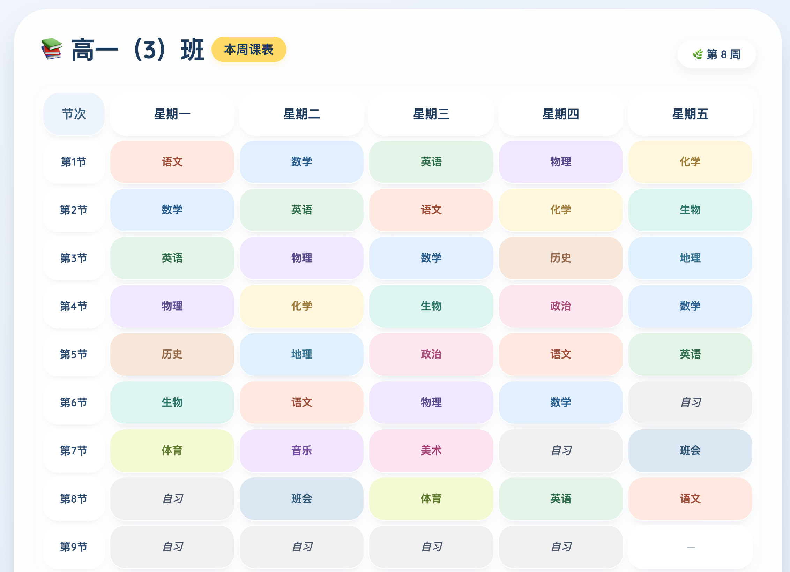
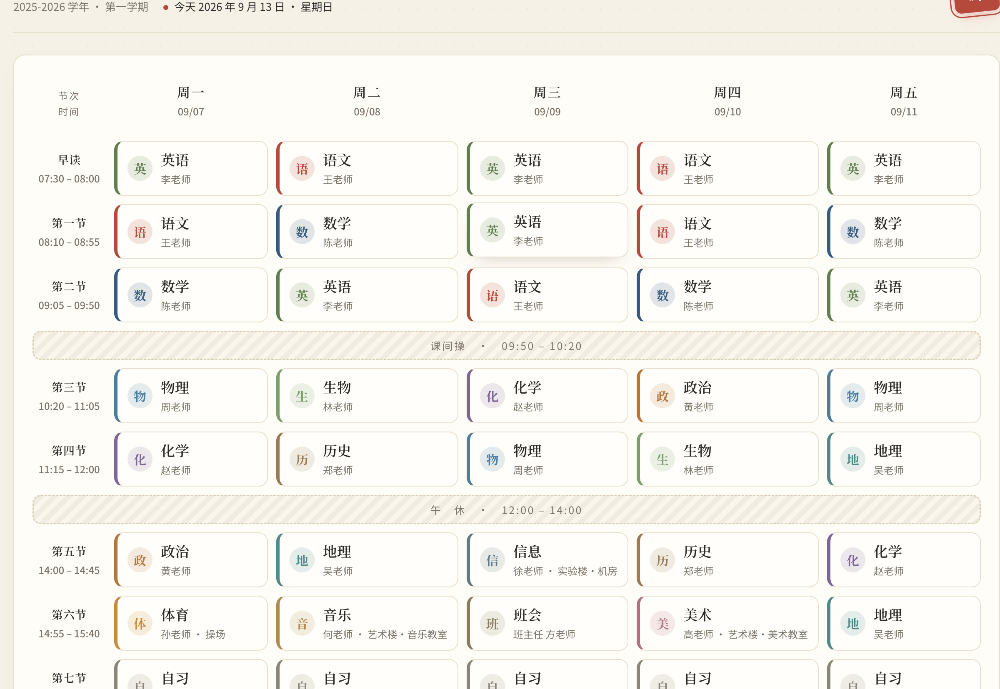
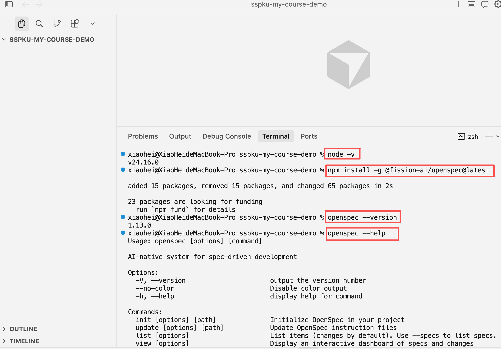
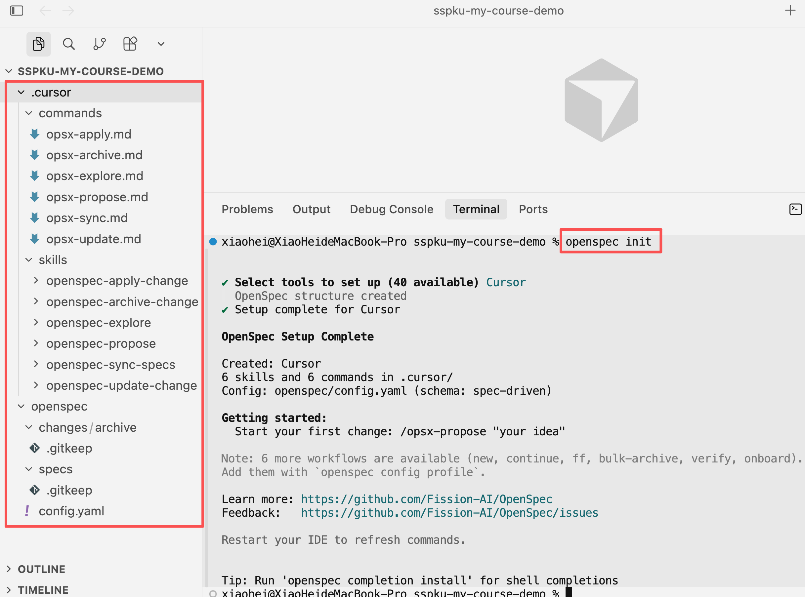
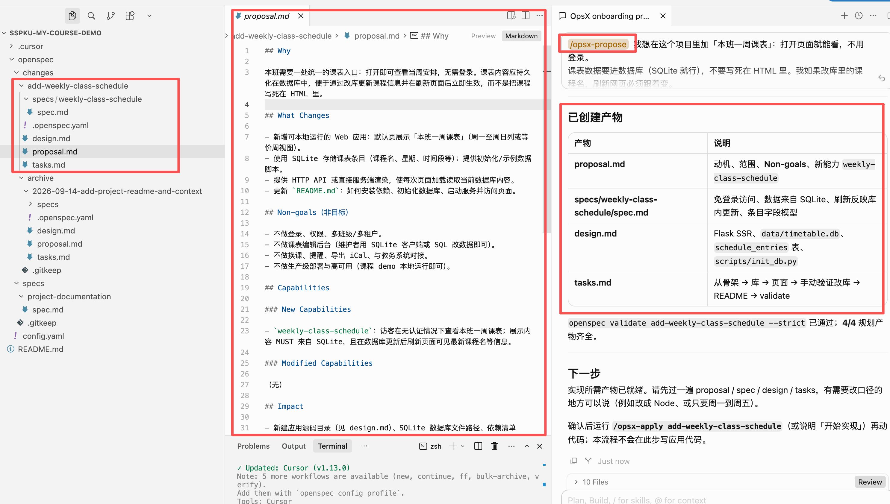

# 第 2 课：SDD 与 CampusClaw 规约

> 来源：北京大学《互联网软件开发技术与实践》第 2 课课件（HTML PPT 整理为 Markdown）
> 主讲人：张齐勋 · 2026 年秋 · 9 月 16 日

---

<!-- 第 1 页 -->

《互联网软件开发技术与实践》· 第 2 课
# SDD 与 CampusClaw 规约
当代码可以由模型生成，工程师最核心的交付物随之转移：不再是代码本身，而是那份把需求说清楚、且可以判定是否达标的规约。代码，只是它的衍生物。
主讲人：张齐勋
单位：北京大学
日期：9 月 16 日（第 2 次课）
会议：腾讯会议 301-524-976
2026 年秋

---

<!-- 第 2 页 -->

01
氛围编程典型困境
凭直觉与模型对话式开发：交付速度很快，但范围、边界与验收标准一直没有确定。问题究竟出在哪里。
02
规约写在仓库里
把规约提升为与代码同等、受版本管理的工程制品。以课程表为例，完整走一遍全流程。
03
CampusClaw 规约
明确工具与仓库：OpenSpec 官方五步如何运转，本课聚焦其中哪两步。
04
动手做
动手完成：登录、角色权限、班级隔离、上传入库，四份规约当堂交付。

---

<!-- 第 3 页 -->

01
## 氛围编程典型困境
以课程表为例：把一句话交给模型，页面很快就能打开。但“看起来做完了”与“真的做完了”是两回事——差别在于规约是否明确。

---

<!-- 第 4 页 -->

1.1
## 课表场景：需求听起来很简单
- 设想一个真实场景：班主任提出需求——“做一个班级课表，能看就行，应该很简单”。
- 把这句话原样交给模型。几分钟后，代码生成，页面确实可以打开。
#### 课堂提示词（第一轮）
```
帮我做一个高一（3）班的本周课程表网页，好看一点就行。
有星期一到星期五，每天几节课。
做一个能直接打开的页面就可以。
```
### 需求方给出的信息
- 班级一周课表
- 基本能看就行
- 应该很简单
### 模型的实际产出
- 数分钟内页面即可打开
- 周一至周五、节次、课名齐备
- 形式上确实简单
本环节
注意：这一轮我们故意只提供一句话——数据持久化、教室、登录权限均未提及。下一页对照结果，盘点缺失了哪些关键规约。

---

<!-- 第 5 页 -->

1.2
## 首轮生成：页面上像已经完成
- 左侧是模型的产出：有表格、有课名，形式上已相当完整。
- 右侧是需求方真正期望的课表。二者的差距在哪里？不在视觉呈现，而在规约是否明确。
### 模型的实际产出
第一轮氛围编程 · 典型产出

### 用户心目中的样子
示意参考 · 含时段、教师、教室等

课堂
左侧可用于演示；右侧才满足真实要求：整周视图、上课时段，以及“修改数据库后页面必须随之更新”。这些约束必须写进规约，而不能依赖下一轮对话补充。

---

<!-- 第 6 页 -->

1.3
## 细看问题：有展示、规约未写清
### 第一轮交出了什么
- 可打开的课表页面
- 星期一到星期五的格子
- 课程名由模型自行编造
- 看起来完整的界面
### 细看之下，缺了这些
- 数据不持久：课程名通常被硬编码在页面中
- 缺失教室字段：需求未提及，模型不会自行补全
- 无法验收：修改数据库后刷新页面是否变化，没有约定
- 缺少边界：未声明非目标，模型可能自行添加登录页

---

<!-- 第 7 页 -->

1.4
## 多轮对话：细节越补越多
①在同一会话中继续补充细节
②发现缺失即追加一条，逐条补发
③结果是：范围随对话不断扩张
#### 课堂提示词（第二轮）
```
课表不要写在页面里，要存进数据库。我改库里的课程名，刷新网页必须变。
每节课还要显示教室。
不要登录，不要做成教务系统。
```
#### 课堂里会发生什么
- 细节后补：查库、改库后刷新可见、不做登录——这些本应在第一轮就明确
- 会话拉长：大量时间消耗在向模型解释需求本身
- 范围漂移：约定只存在于本次对话中，换一个会话即失效
注意“教室”这一需求：直到第三轮才出现，且仅存在于聊天记录中。接下来，我们将同一份课表需求写入 openspec/changes/…/ 下的四份文件。

---

<!-- 第 8 页 -->

1.5
## 氛围编程（Vibe Coding）
1
### 边聊边改
范围随对话持续扩张，大量时间用于纠正模型的自行发挥。
2
### 质量参差
同一句话，更换模型后得到的字段、数据与边界处理各不相同。
3
### 最终返工
约定只存在于聊天记录，他人接手时需要重新复述全部上下文。
这种方式被称为 Vibe Coding：效率很高，但难以形成可交付、可维护的工程资产。接下来看规约驱动的做法：演示仓 sspku-my-course-demo 中，用 OpenSpec 为课表生成四份规约文件。编码实现属于第 3 课的内容。

---

<!-- 第 9 页 -->

02
## SDD：规约写进仓库
本部分演示路线：init → /opsx-propose 课表 → 逐份 Review 四件套原文（样板：add-weekly-class-schedule）。

---

<!-- 第 10 页 -->

2.0
## 工程师交付：规约为主、代码为衍生物
- 核心产物：change 目录下的四份 Markdown（Why / Decisions / ADDED Requirements / tasks 分节）——做什么、不做什么、如何判定完成，全都明确写下来。
- 衍生物：代码由模型依据规约生成。规约越模糊，生成速度越快，返工成本越高。
- 进仓库：规约与代码同仓管理。后续变更行为时，先修改 Markdown，再让模型实现。
### 结构化规约 · 仓库目录
课表 change · 四件套（本课样板）
sspku-my-course-demo
```
openspec/changes/add-weekly-class-schedule/
├── proposal.md Why · What Changes · Non-goals
├── design.md Flask SSR · schedule_entries
├── tasks.md §1 骨架 … §5 validate
└── specs/weekly-class-schedule/spec.md
```
与 2.3 Propose 产出、课表样板页 中的原文完全一致，稍后逐行对照
### 依规约 · 智能体生成代码
spec Scenario → Apply 阶段代码（示意）
app/__init__.py · GET /
```
@app.get("/")
def schedule():
rows = fetch_entries() # schedule_entries
return render_template(
"schedule.html", rows=rows)
```
spec：Refresh reflects database updates ——修改数据库中的 course_name，刷新后页面必须显示新名称
注意顺序：先有左侧规约，tasks.md §3–4 再让模型写出 Flask 代码与页面

---

<!-- 第 11 页 -->

2.1
## SDD：先写规约，再写代码
1
统一意图Why · 范围 · Non-goals
① proposal.md
```
## Why
课表数据进 SQLite，
勿写死 HTML。
## Non-goals
- 无登录 / 无管理端
- 不对接教务
```
2
技术决策组件·数据流·design
② design.md
```
Decision 2: SSR
GET / 查 SQLite，
Jinja 渲染 schedule.html
库: data/timetable.db
表: schedule_entries
```
3
可验收规约行为·数据·接口
③ spec.md
```
Scenario: Course name
changed in database
- WHEN 改 course_name
- AND reload /
- THEN 显示新名称
```
4
任务拆解加载 Markdown·按序实现
④ tasks.md
```
## 3. 课表页面
- [ ] GET / + schedule.html
## 4. 刷新与一致性
- [ ] sqlite3 改库手验
## 5. 文档
- [ ] README + validate
```
与氛围编程对比
接下来按此推进：示意 init → /opsx-propose → 2.3 查看产出摘要 → 2.5 起，逐份精读。

---

<!-- 第 12 页 -->

示意
## OpenSpec 环境：安装 CLI 与 openspec init
### ① 安装 OpenSpec CLI

### ② 项目 init


---

<!-- 第 13 页 -->

示意
## openspec init 后：仓里多了什么
#### sspku-my-course-demo · init 后
```
┌────────────────────────────────────────────────────────────────┐
│ sspku-my-course-demo（新仓库）
│ │
│ ├── README.md ← 给人看：用途、结构、下一步
│ └── openspec/
│ ├── config.yaml ← 给 AI 看：context / rules
│ ├── specs/ ← 能力规约（长期真相源）
│ └── changes/ ← 每次变更的规划与归档
└────────────────────────────────────────────────────────────────┘
```
下一节
请记住这个结构：specs/ 存放长期规约，changes/ 存放每一次变更。课表本次变更即将落入 changes/ 里。2.2 将演示如何让模型生成这些文件。

---

<!-- 第 14 页 -->

2.2
## IDE 三层：规则 · 技能 · 命令
- 目录建好后，还需要一个入口。下一页执行 /opsx-propose，把课表需求描述清楚，由模型在 changes/ 下生成文件。先认识 Cursor 中的三类入口。
- 本课演示以 Cursor 为准；使用 Trae、Claude Code 等工具同样适用——目录名不同（如 .trae/skills），但机制一致。
类型作用Cursor 里常见位置 / 用法
规则长期约束：遵循什么约定、禁止什么行为演示仓：README + openspec/config.yaml；学期仓另加项目规则文件（AGENTS.md、CLAUDE.md 等，第四部分）
技能封装好的工作流——读取哪些文件、按何种步骤产出四件套.cursor/skills/<名>/SKILL.md；在技能面板选用，或在对话中指名 openspec-propose
命令对话框中的快捷入口，底层调用上述技能.cursor/commands/ 下的 Markdown 文件；输入 / 选择 opsx-propose（以 init 后为准）
和四件套的关系
命令（如 /opsx-propose）负责发起流程，文件负责固化结果——所有细节写入 proposal.md / design.md / spec.md / tasks.md 之中，而非停留在对话里。

---

<!-- 第 15 页 -->

示意
## 课表需求 → /opsx-propose
#### 先执行 /opsx-propose，再用自然语言把需求描述清楚（示例）：
复制
```
我想在这个项目里加“本班一周课表”：打开页面就能看，不用登录。
课表数据要进数据库（SQLite 就行），不要写死在 HTML 里。我如果改库里的课程名，刷新网页必须跟着变。
```
### Propose 过程（演示仓 · 真实截图）

产出
注意：模型没有编写代码，生成的是一份变更计划。摘要见 2.3，四份文件全文见 课表样板页，与仓库原文完全一致。

---

<!-- 第 16 页 -->

2.3
## Propose 产出摘要
变更：add-weekly-class-schedule
位置：openspec/changes/add-weekly-class-schedule/
#### 规划假设
- 本班：仅考虑单个班级，不支持多班级
- 视图：一周七列，无课时段留空
- 改数据：用 sqlite3 或 SQL 直接改库，不提供管理后台
- 技术上：Python + Flask + SQLite；服务端渲染：每次刷新都重新查库，天然满足“改库后刷新可见”
已创建产物说明
proposal.md动机、范围、Non-goals 与新能力 weekly-class-schedule
specs/weekly-class-schedule/spec.md免登录访问、SQLite 为数据来源、刷新反映库变更、条目字段模型
design.mdFlask SSR、库路径 data/timetable.db、表 schedule_entries、脚本 scripts/init_db.py
tasks.md骨架 → 库 → 页面 → 改库手验 → README → validate
审规约
初稿生成后不要直接采用。Review 分三步：范围是否正确 → 每条要求是否可判定通过与否 → 任务是否完整覆盖规约。2.5 对照 CampusClaw；2.6 起 + 课表样板页，逐页阅读原文。

---

<!-- 第 17 页 -->

2.5
## 课表 change 与 CampusClaw 对照
- 中间一列是课表 change 各文件的内容；右侧一列是第三部分中各位需要独立完成的 CampusClaw 规约。两者流程完全一致，差别仅在业务内容。
写什么课表 change（演示仓）CampusClaw 当堂（第三部分）
动机与范围proposal.md · Why / Non-goals登录、隔离、上传入库；非目标含检索/对话
技术方案design.md · Flask SSR、schedule_entriesBrowser / App / DB、Compose 部署节
可验收行为specs/weekly-class-schedule/spec.mddelta Scenario：权限、跨班、/health 等
实现顺序tasks.md §1–5 + validate逐条小任务 + 加载清单；当堂 [ ]
IDE 入口.cursor/commands · /opsx-propose同技能链；Propose 后 Review
记住
两个仓库、两份 change，务必区分清楚。尤其不可将课表内容写入 CampusClaw 的 proposal。

---

<!-- 第 18 页 -->

2.6
## proposal.md：需求边界与非目标
章节课表示例学生自检
Why统一课表入口；数据进库、改库刷新生效□ 能一句话说清用户与痛点
What ChangesWeb 应用 + SQLite + README 运行说明□ 交付物列全
Non-goals无登录/管理端/教务对接/生产部署□ 非目标写全，防范围膨胀
Capabilitiesweekly-class-schedule 须查库、刷新可见□ 与 spec 目录名一致
Impact新建 app 目录、requirements.txt、README 运行说明□ 与 design / tasks 一致
常见漏项
最容易遗漏的是 Non-goals。不声明“不做什么”，模型就会自行决定——登录页、管理端都可能出现（参见 1.3）。下一页对照仓库中的 proposal.md 原文。

---

<!-- 第 19 页 -->

样板
## 课表样板 · proposal.md（仓库原文）
#### add-weekly-class-schedule · proposal.md（全文）
复制
```
## Why
本班需要一处统一的课表入口：打开即可查看当周安排，无需登录。课表内容应持久化在数据库中，便于通过改库更新课程信息并在刷新页面后立即生效，而不是把课程写死在 HTML 里。
## What Changes
- 新增可本地运行的 Web 应用：默认页展示“本班一周课表”（周一至周日列或等价周视图）。
- 使用 SQLite 存储课表条目（课程名、星期、时间段等）；提供初始化/示例数据脚本。
- 提供 HTTP API 或直接服务端渲染，使每次页面加载读取当前数据库内容。
- 更新 `README.md`：如何安装依赖、初始化数据库、启动服务并访问页面。
## Non-goals（非目标）
- 不做登录、权限、多班级/多租户。
- 不做课表编辑后台（维护者用 SQLite 客户端或 SQL 改数据即可）。
- 不做换课、提醒、导出 iCal、与教务系统对接。
- 不做生产级部署与高可用（课程 demo 本地运行即可）。
## Capabilities
### New Capabilities
- `weekly-class-schedule`：访客在无认证情况下查看本班一周课表；展示内容 MUST 来自 SQLite，且在数据库更新后刷新页面可见最新课程名等信息。
### Modified Capabilities
（无）
## Impact
- 新建应用源码目录（见 design.md）、SQLite 数据库文件路径、依赖清单（如 `requirements.txt`）。
- `README.md` 增加应用运行说明（不改变 `project-documentation` 既有 requirement 的语义，仅补充内容）。
```
衔接
技术方案详见 2.7 design 及 课表样板 · design.md（Flask SSR、schedule_entries）。

---

<!-- 第 20 页 -->

2.7
## design.md：架构、数据流与选型
- 技术选型：Python + Flask + sqlite3，SSR（GET / 查库 → schedule.html）。每次刷新都重新查库，proposal 里说“每次加载读取当前库”，靠的就是这个。
- 数据：data/timetable.db、表 schedule_entries、种子脚本 scripts/init_db.py，细节在 Decision 3–4。
- 非目标直接引用 proposal.md；本地 127.0.0.1:5000，仅启动本地服务，不涉及 Docker——CampusClaw 的 Compose 部署属于另一个 change。
#### design.md · SSR 数据流（与 spec 一致）
```
Browser → GET /
Flask → SELECT … FROM schedule_entries ORDER BY weekday
→ render_template("schedule.html", …)
SQLite ← data/timetable.db（改 course_name 后 reload 即验收）
```
下一页
五条决策的完整原文见 课表样板 · design.md，下一页逐条阅读。

---

<!-- 第 21 页 -->

样板
## 课表样板 · design.md（仓库原文）
#### add-weekly-class-schedule · design.md（全文）
复制
```
## Context
仓库目前仅有 OpenSpec 与 README，无应用代码。动机见 `proposal.md`。目标是在本地起一个简单 Web 服务，SQLite 为唯一课表数据源。
## Goals / Non-Goals
**Goals:**
- 单页课表视图 + SQLite 持久化 + 刷新即见库内最新数据。
- 依赖少、便于课程 demo 一键启动（文档写清命令）。
**Non-Goals:**
- 见 `proposal.md` 非目标（无登录、无管理端、不对接教务）。
## Decisions
### Decision 1: Python + Flask + 标准库 `sqlite3`
使用 Flask 提供 HTTP，SQLite 通过 Python 标准库访问，依赖仅 Flask（`requirements.txt`）。
**备选：** Node + Express —— 同样可行；本 demo 优先 Python 以降低课程环境差异。
### Decision 2: 服务端渲染（SSR）为主
`GET /` 在服务端查询 SQLite，用 Jinja2 模板渲染 HTML 表格/网格。每次完整刷新都会重新查库，自然满足“改库后刷新可见”。
**备选：** 静态页 + `GET /api/schedule` JSON —— 也可满足 spec，但 SSR 更少 moving parts，首屏无需额外 fetch。
### Decision 3: 数据模型与文件位置
- 库文件：`data/timetable.db`（可 `.gitignore`，由 seed 脚本生成）。
- 表 `schedule_entries`：`id` INTEGER PK，`weekday` INTEGER 1–7（1=周一）、`start_time` TEXT `HH:MM`、`end_time` TEXT `HH:MM`、`course_name` TEXT NOT NULL；可选 `location` TEXT。
- 脚本 `scripts/init_db.py`：建表并插入示例本班数据。
### Decision 4: 应用布局
app/
__init__.py # create_app(), 注册路由
db.py # get_connection(), fetch_entries()
templates/
schedule.html # 一周课表视图
scripts/
init_db.py
data/
timetable.db # 本地生成
requirements.txt
run.py # flask run 入口（或 python -m flask）
### Decision 5: 本地运行约定
- 默认 `http://127.0.0.1:5000/`
- README 说明：`pip install -r requirements.txt` → `python scripts/init_db.py` → `python run.py`
## Risks / Trade-offs
- [并发写库与 Flask dev server] → demo 只读访问为主；维护者改库时短暂锁表可接受。
- [时间格式未统一时区] → 仅存本地 `HH:MM` 字符串，不涉及跨时区。
## Migration Plan
全新仓库（Greenfield）：首次运行 `init_db.py` 创建库，没有旧数据需要迁移。
## Open Questions
（无——技术栈与 SSR 方案已足以拆分 tasks。）
```

---

<!-- 第 22 页 -->

2.8
## spec.md：Requirement 与 Scenario
- 路径：specs/weekly-class-schedule/spec.md；delta 标题 ADDED Requirements，Requirement 的名字用英文——这是 OpenSpec 的默认写法。
- Scenario 采用 WHEN / THEN / AND，每一条都具备可验证性：查询数据库、空库不报错，其中最关键的是 Refresh reflects database updates——修改数据库后刷新，页面必须呈现新名称。
- 唯一的检验标准：仅依据这份文件，能否判定通过或不通过？——对应 tasks.md §4.1。
课表要覆盖的能力Requirement 名（样板）Scenario 要点
打开即见、无登录Anonymous weekly schedule pageWHEN 打开 `/` → THEN 一周布局；无登录提示
必须查库Schedule content is loaded from SQLite有数据则展示；空库仍 200
改库刷新Refresh reflects database updates改 course_name 后 reload 可见
数据模型Timetable entry data modelweekday + 起止时间 + 课程名可展示
下一页
原文分上下两页（课表样板 · spec.md）。 tasks.md §4.1

---

<!-- 第 23 页 -->

样板
## 课表样板 · spec.md（上）
#### weekly-class-schedule/spec.md（上）
复制
```
## Purpose
让本班成员通过浏览器查看存储在 SQLite 中的一周课表，无需登录；页面展示始终反映数据库当前内容。
## ADDED Requirements
### Requirement: Anonymous weekly schedule page
The system MUST serve a default web page that displays the class weekly timetable without requiring authentication.
#### Scenario: Visitor opens the app root
- **WHEN** 用户在浏览器打开应用根路径（如 `/`）
- **THEN** 页面展示标题或说明，表明为“本班一周课表”
- **AND** 页面展示周一至周日（或等价的一周七列/七区）的课表布局
#### Scenario: No login prompt
- **WHEN** 未携带任何会话或凭证的用户访问课表页
- **THEN** 系统 MUST NOT 要求登录、注册或输入密码即可查看课表
### Requirement: Schedule content is loaded from SQLite
The system MUST read timetable entries from a SQLite database at request time; course names and other displayed fields MUST NOT be hardcoded only in static HTML as the sole source of truth.
#### Scenario: Page reflects database rows
- **WHEN** 数据库中存在若干课表条目（含课程名、星期、开始/结束时间）
- **THEN** 打开或刷新课表页时，页面 MUST 展示这些条目中的课程名与时间安排
#### Scenario: Empty database
- **WHEN** 数据库中没有任何课表条目
- **THEN** 页面 MUST 正常加载并提示暂无课程或展示空课表，而不是返回未处理的服务器错误
```

---

<!-- 第 24 页 -->

样板
## 课表样板 · spec.md（下）
#### weekly-class-schedule/spec.md（下）
复制
```
### Requirement: Refresh reflects database updates
The system MUST reflect updates made directly in SQLite after the user refreshes the page.
#### Scenario: Course name changed in database
- **WHEN** 维护者在 SQLite 中将某条目的课程名修改为新的名称
- **AND** 用户在同一浏览器中刷新课表页（完整页面 reload）
- **THEN** 页面 MUST 显示更新后的课程名
### Requirement: Timetable entry data model
Each timetable entry stored in SQLite MUST include at least: weekday (Monday–Sunday), start time, end time, and course name.
#### Scenario: Valid entry is displayable
- **WHEN** 条目包含合法的 weekday、start time、end time 与 course name
- **THEN** 该条目 MUST 出现在对应 weekday 的课表视图中，并显示课程名与时间范围
```

---

<!-- 第 25 页 -->

2.9
## tasks.md：分节 checklist 与 verify
1–2
### 骨架与库
Flask + init_db.py + schedule_entries。动手前先读 design 和 spec 里的数据模型。
3–4
### SSR 与验收
GET / 查库渲染页面，再手动改一次库做验收。动手前读 spec 全文。
5
### 文档与 validate
README 应保证他人可从零启动；openspec validate 要一次通过。
- 这就是实施顺序：§1 骨架 → §2 库 → §3 页面 → §4 改库手验 → §5 README + validate；每一步都附带 verify:。
- 注意：初稿生成时所有复选框均为未勾选状态 [ ]。勾选发生在第 3 课的 Apply 阶段。

---

<!-- 第 26 页 -->

样板
## 课表样板 · tasks.md（仓库原文）
#### add-weekly-class-schedule · tasks.md（全文）
复制
```
## 1. 项目骨架
- [ ] 1.1 添加 `requirements.txt`（Flask）与 `run.py` 启动入口 — verify: `pip install -r requirements.txt` 成功
- [ ] 1.2 创建 `app/` 包（`create_app`、配置 SQLite 路径 `data/timetable.db`）— verify: 导入 `app` 无报错
## 2. 数据库
- [ ] 2.1 实现 `scripts/init_db.py`：建表 `schedule_entries` 并插入至少 3 条示例课 — verify: 运行后 `data/timetable.db` 存在且 `sqlite3 data/timetable.db "SELECT course_name FROM schedule_entries"` 有结果
- [ ] 2.2 实现 `app/db.py`：按 weekday 排序读取全部条目 — verify: 单元测试或临时脚本打印条目数与库一致
## 3. 课表页面
- [ ] 3.1 实现 `GET /`：查库并渲染 `templates/schedule.html`（周一至周日、课程名、时间）— verify: 启动服务后浏览器打开 `/` 可见示例课程
- [ ] 3.2 空库与错误路径：无数据时友好空状态 — verify: 清空表后刷新仍 200 且有空课表提示
## 4. 刷新与数据一致性
- [ ] 4.1 手动验证：用 `sqlite3` 修改某条 `course_name` 后刷新页面显示新名称 — verify: 与 spec“Refresh reflects database updates”一致
## 5. 文档与收尾
- [ ] 5.1 更新 `README.md`：安装、init_db、启动、访问 URL — verify: 按 README 步骤可从零打开课表页
- [ ] 5.2 运行 `openspec validate add-weekly-class-schedule --strict` — verify: 无 error
```

---

<!-- 第 27 页 -->

2.10
## 对比：长对话 vs 规约进仓
### 氛围编程
- 查库、改库后刷新可见、不做登录——依赖 1.4 中的逐轮补充
- “增加教室”的需求只存在于对话中，无法被评审
- 页面可以运行，但改 course_name 刷新 从未被写为验收条件
- 他人接手时，只能回溯聊天记录
### SDD · 规约进仓库
- openspec/changes/add-weekly-class-schedule/ 四份文件可被查看、修改与 diff
- 开启新会话后，模型读取 spec 即明确：必须查询数据库，禁止硬编码
- Refresh reflects database updates 被写成明确的验收条件，对应 tasks §4.1
- 若要增加教室：先开启新 change 修改规约，再进入实现
要点
同一份课表需求，两种结局：Vibe Coding 交付一个页面；SDD 交付一份可通过 openspec validate 校验的规约。第三部分起：请各位使用同一套工具，独立完成 CampusClaw 的 change，注意与课表仓库区分。

---

<!-- 第 28 页 -->

03
## OpenSpec 与 CampusClaw 当堂目标
工具与仓库都要明确区分。OpenSpec 官方五步中，本课只走前两步，但要求做扎实。

---

<!-- 第 29 页 -->

3.0
## 课表练习仓 vs 学期项目仓
对比项课表练习仓CampusClaw 学期仓
用途演示流程：一句话如何转化为四份规约本课交付所在：CampusClaw 需求规约
文件夹名sdd-lab-timetable（课后可自建）campusclaw-<组名>（当堂新建）
IDE 打开可不打开必须打开，本课所有操作均在此进行
当堂产物无openspec/changes/…/ 下的四份文件
禁止
特别提示：不得将课表练习仓改名后充当本次交付，也不得将课表内容混入 CampusClaw 的 change。

---

<!-- 第 30 页 -->

3.1
## OpenSpec：SDD 制品写进 Git
- 它是什么：将规约转化为仓库中的普通文件，可查看、可修改、可纳入 Git 历史。
- 一次变更 = 一个 change：先在 openspec/changes/<change>/ 中进行规划；完成后归档，合并进 openspec/specs/，成为后续开发的依据。
- 本课只走前两步：即 Propose 与 Review，且要求做扎实。Apply 与 Archive 安排在第 3 课。

---

<!-- 第 31 页 -->

3.2
## init 之后：目录、config 与技能
#### 学期仓根目录（示意）
```
campusclaw-mygroup/
├── AGENTS.md ← 项目规则：无规约不写代码（视工具而定）
├── README.md ← 三行说明：价值、场景、本学期不做
└── openspec/
├── config.yaml ← 给 AI 看的上下文与规则
├── specs/ ← 长期真相源，Archive 后并入
└── changes/ ← 每次变更的四份文件
```
- init 完成后，仓库根目录会有 openspec/；项目规则文件名随所用工具而定，可自行新建（如 AGENTS.md、CLAUDE.md）。
- openspec init --tools <你的工具>，其中 --tools 参数指明所用工具，命令模板将被安装到对应目录（trae / cursor / claude / codex / agents）。
- 重启 IDE 后输入 /，若能看到 openspec 相关命令，即表示安装成功。

---

<!-- 第 32 页 -->

3.3
## 官方五步循环与本课边界
1
Explore明确待办事项，可选
2
Propose生成四份 Markdown 初稿
3
Review修订 Markdown，直到每条可判定
4
Apply第 3 课——按 tasks 实现代码
5
Archive第 3 课——归档进 specs/
本课当堂
再次明确本课边界：只做第 2、3 步。不 Apply、不编写业务代码、不运行 Compose。

---

<!-- 第 33 页 -->

3.4
## 四件套对应 change 目录结构
#### Propose 之后 · 课表示例
```
openspec/changes/add-class-timetable/
├── proposal.md ← 为什么做、范围、Non-goals
├── design.md ← 技术决策、数据流
├── specs/
│ └── class-timetable/
│ └── spec.md ← delta：Requirement + Scenario
└── tasks.md ← 实现顺序 checklist，当堂仍为 [ ]
```
Archive 之后
change 移入 changes/archive/ 归档目录，规约合并进 openspec/specs/。后续变更均从这份最新规约出发。

---

<!-- 第 34 页 -->

3.5
## 当堂路线：Propose → Review → 验收
1
建学期仓在 IDE 中打开仓库根目录
2
Propose写登录、隔离、上传入库
3
Review按清单互相检查，改到每条都能判定
4
新对话引用 spec 原文验收
本课要求
本课路线即上述四步；下课前请自查：change 四件套齐备，且仓库中不含任何业务代码。

---

<!-- 第 35 页 -->

04
## 动手写 CampusClaw 规约
演示到此为止。接下来请各位为自己的学期项目撰写第一份需求规约。
- 交付物：openspec/changes/<change>/ 下的四份文件
- 内容必须覆盖：登录、角色权限、班级隔离、上传入库
- 所有 checkbox 保持未勾选 [ ]，本课不执行 Apply
- 课表与 CampusClaw 分属两个仓库，不得混用

---

<!-- 第 36 页 -->

4.1
## 环境准备与本课交付物
- 环境要求：编程工具可正常对话（Trae / Cursor / Claude Code / Codex / WorkBuddy 任选其一），node -v 不低于 v20。
- npm install -g @fission-ai/openspec@latest 安装完成后，openspec --version 能输出版本号即表示安装成功。
- Spec Kit 与 Docker 本课无需安装，不必提前准备。
R
README三行说明：价值、场景、不做
规
规则文件无规约不写代码
C
change四份 Markdown：proposal 至 tasks
T
tasks实现顺序，当堂全留空
时间建议
时间分配：建仓 20 分钟，提案 25 分钟，互相检查 30 分钟，验收与小结 20 分钟。

---

<!-- 第 37 页 -->

4.2
## 新建学期仓并 openspec init
①打开系统终端新建空仓库——不要让模型在对话中代建
②在仓根新建项目规则文件，并填写 README 三行说明
③用编程工具打开该仓库，执行 openspec init
④重启工具，输入斜杠命令，确认已就位
#### macOS / Linux（①②③ 可整段复制）
复制
```
mkdir -p ~/campusclaw-mygroup
cd ~/campusclaw-mygroup
git init
# 新建项目规则文件 AGENTS.md：无规约不写代码（名称随工具而定）
openspec init --tools cursor # 换成你的工具：trae / claude / codex / agents
```
#### Windows PowerShell
复制
```
New-Item -ItemType Directory -Force "$HOME\campusclaw-mygroup" | Out-Null
Set-Location "$HOME\campusclaw-mygroup"
git init
# 新建项目规则文件 AGENTS.md：无规约不写代码（名称随工具而定）
openspec init --tools cursor
```
- 务必确认打开的目录：campusclaw-mygroup，而非课程仓库，更不是课表练习仓 sdd-lab-timetable。
- 若全局安装失败，可改用 npx @fission-ai/openspec@latest init --tools cursor，效果相同。
完成标准
仓库根目录包含 openspec/config.yaml、openspec/changes/ 与 README 三行说明；项目规则文件按所用工具放置（如 AGENTS.md）。

---

<!-- 第 38 页 -->

4.3
## Propose：生成 change 初稿
①新建对话，工作区选择学期仓
②输入 /opsx-propose，将下一页的提示词整段粘贴
③等待四份文件生成完毕，不要中断
④记录 change 目录名，后续操作均依赖它
#### 师生共同确认（写入文件方为有效）
- 登录与角色：教师、学生两类角色；未登录访问受保护页面须被引导到登录页
- 班级隔离：班级是数据边界，过滤必须在服务端做；A 班用户不得读取 B 班材料
- 上传与入库：教师上传后解析写入知识库，本班列表查库展示；学生上传必须被拒绝
- 本课不做：检索问答、AI 对话、作业提交与批改、注册与找回密码
撰写时不要自由发挥：这四项一条都不能少，也不要额外增加内容。

---

<!-- 第 39 页 -->

4.4
## Propose 提示词（勿写代码）
#### 整段复制给 /opsx-propose
复制
```
/opsx-propose
项目加一个变更：用户登录、角色权限、班级隔离，教师可以把教学材料上传进知识库。
- 教师、学生都能用账号密码登录；没登录访问受保护页面，会被引导到登录页；
- 学生不能上传材料，调用上传接口必须被拒绝；
- 班级是数据边界：A 班的人访问 B 班材料要被拒绝；过滤放在服务端，不靠前端隐藏按钮；
- 教师上传的材料要写入知识库，本班材料列表能查到这条记录。
密码必须哈希存储，禁止明文；密钥只放服务端环境变量。启动方式用 Docker Compose，应用提供 GET /health。
```

---

<!-- 第 40 页 -->

4.5
## 初稿核对清单
第 39 页 Propose 出来的只是初稿，常缺 Scenario、Non-goals 或 tasks 分节。请按下表逐项核对，也可以和相邻同学互查；有缺项就用下一页的补全提示词改 Markdown。补全后的终稿已归档在 AI-DevOps/project-src/week02/，下文 Ex 与 Review 都对照它。change 目录名以你仓内为准（演示为 add-auth-rbac-class-knowledge）。
文件应有内容（逐项核对打勾）
README + proposalREADME 三行；proposal 含 Why / What / Capabilities（如 auth-upload）/ Non-goals；What 含登录、角色、隔离、上传入库、预置样本、Compose 与 /health
specs/…/spec.md登录、角色、隔离、上传、预置、密码哈希、Compose/health 等 Requirement；每条带可判定 Scenario
spec 格式英文骨架 ADDED Requirements / Requirement: / Scenario:；Scenario 可用 WHEN/THEN/AND 或 当/那么/且
design.md技术栈、会话与密码哈希、查询层班级隔离、上传入库数据流、数据模型、Compose 与 healthcheck
tasks.md分节 checklist（骨架→种子→登录→隔离→上传→Compose→validate）；每条 verify；checkbox 全 [ ]
记住
核对的是 Markdown 制品是否写全、Scenario 能不能判定通过；本课仍然不写业务代码。

---

<!-- 第 41 页 -->

4.5
## 初稿缺项 · 补全提示词
上一页核对出缺项时：新建对话，把下面这段提示词整段粘贴进去（路径里的 change 名要改成你自己的目录）。演示仓就是用这同一段提示词补出来的，结果见 AI-DevOps/project-src/week02/，下文 Ex 与 Review 都对照这份终稿。
#### 补全提示词（初稿生成后再发）
复制
```
初稿已生成，但内容不全。请只修改 openspec/changes/add-auth-rbac-class-knowledge 下的 markdown，不要写业务代码。
请补全：
1. spec.md：登录、角色、班级隔离、上传入库、预置数据、密码哈希、Compose/health 等 Requirement 及 Scenario（含跨班被拒、学生上传 403、上传后列表可查）。
2. design.md：会话与密码、Flask/SQLite（或等价栈）、服务端班级过滤、上传数据流、Compose 与 GET /health。
3. tasks.md：按实现顺序分节，每条带 verify；最后一节含 openspec validate --strict；checkbox 保持 [ ]。
4. proposal：Non-goals 含检索问答、对话助手、作业提交与批改、SSO/生产 HA 等本课不做项。
改完列出：改了哪些文件、每处补了什么。
```
对照
目标：补全到与 project-src/week02 同级即可——结构完整、Scenario 可判定。Ex 节摘抄的就是这份终稿，change 目录名不必相同。

---

<!-- 第 42 页 -->

对照SAMPLE
Ex
## Review 对照 · 终稿全文
- 以下摘抄第 41 页补全之后的终稿：AI-DevOps/project-src/week02/openspec/changes/add-auth-rbac-class-knowledge/。
- 每页文末有点评：说明这份文件在 Review 时该看什么，格式不要求背诵。
- 顺序：Ex.1 proposal → Ex.2 design（4 页：上 / 中 / 下 / 部署）→ Ex.3 spec（3 页）→ Ex.4 tasks（2 页）。
- 与相邻同学互查时问两句：Scenario 能不能判定通过？tasks 有没有覆盖全部 Requirement？

---

<!-- 第 43 页 -->

Ex.1
## 终稿 · proposal.md
#### proposal.md · Why / What / Non-goals
复制
```
## Why
CampusClaw 是面向中小学的教研智能体，覆盖学情分析、备课、命题、课堂与教研协同，教研材料与知识库是其能力底座。当前材料分散在群文件与网盘中，教师难以检索复用，班级之间也缺少数据边界。本变更先建立**身份、角色与班级隔离**，让教师登录后上传并管理本班材料，学生仅可查看本班内容，为后续检索与智能问答打基础。
## What Changes
- **用户登录**：教师、学生两类角色；账号密码登录；未登录访问受保护页面时引导至登录页。
- **角色权限**：教师可上传与管理本班材料；学生对本班材料只读；学生调用上传接口 MUST 被拒绝（如 HTTP 403）。
- **班级隔离**：班级为数据边界；所有业务查询在服务端按会话中的班级过滤；A 班用户不得读取 B 班材料（含直接访问与列表越权）。
- **材料上传与知识库入库**：教师上传后解析并写入知识库，材料关联本班；本班材料列表查库展示，上传后可见新记录。
- **预置样本数据**：班级 A/B、教师 A、学生 A1/B1，以及两班可区分的材料标题；建立班级、用户、讲义、作业、助手、技能六类核心数据结构并写入种子数据。
- **安全与运行**：密码 MUST 哈希存储，禁止明文；会话/签名密钥仅通过服务端环境变量注入；标准启动方式为 Docker Compose；应用提供 `GET /health`。
- **文档**：README 三行说明（价值、场景、不做）与 Docker 启动方式；新增 `docker-compose.yml`、`.env.example`。
## Capabilities
### New Capabilities
- `auth-upload`：登录与会话、按角色授权、按班级隔离、教师上传材料入库、预置数据、密码哈希与会话密钥、Docker Compose 与 `/health` 等可验收行为。
### Modified Capabilities
（无——`openspec/specs/` 尚无主规格。）
## Impact
- 新建 Web 应用与 API（登录、材料列表、教师上传、健康检查）。
- 新建 SQLite（或等价）持久层：用户、班级、材料、知识库条目及六类域表与种子数据脚本。
- 项目根增加 `Dockerfile`、`docker-compose.yml`、`.env.example`；依赖清单（如 `requirements.txt`）。
- 可运行实现按 `tasks.md` 在 Apply 阶段完成；本 change 以规约四件套为交付物。
## Non-goals（非目标）
本课/本 change **明确不做**以下内容（避免范围膨胀；表结构可预留字段，但不验收）：
- **检索与问答**：不做 RAG、全文检索、智能问答、基于知识库的对话。
- **对话助手**：不做聊天界面、Agent 编排、技能包运行时。
- **作业流程**：不做作业提交、批改、成绩、审计与错题本。
- **身份与企业集成**：不做多校/多租户、OAuth/OIDC、SSO、短信/邮箱验证码登录。
- **生产运维**：不做 K8s、多副本高可用、完整 CI/CD 流水线；标准启动为 Docker Compose 本地/演示环境即可。
- **前端替代服务端安全**：不以隐藏按钮、禁用表单作为权限或班级隔离的唯一手段。
```
点评
Why 只讲痛点；What 列交付能力；Non-goals 分条写清“检索、对话、作业、SSO、生产 HA”——这是防范围膨胀的第一道闸。

---

<!-- 第 44 页 -->

Ex.2
## 终稿 · design.md（上）
#### design.md · Context 与 Goals
复制
```
## Context
仓库根已有 README 三行说明与 OpenSpec change 四件套；尚无业务应用代码。动机见 `proposal.md`；可验收行为见 `specs/auth-upload/spec.md`。Apply 阶段在本仓库实现 CampusClaw 最小可运行栈。
## Goals / Non-Goals
**Goals:**
- 登录可用，会话携带 `role` 与 `class_id`。
- 权限在服务端可判定（学生上传 403）。
- 班级隔离不可通过改前端绕过（查询与按 ID 访问均校验班级）。
- 教师上传链路：落盘 → 解析 → 双表入库 → 列表查库可见。
- `docker compose up` 一键启动；`GET /health` 供探活；密钥与 DB 路径可配置。
**Non-Goals:**
- 见 `proposal.md` Non-goals（检索问答、对话、作业、SSO、生产 HA 等）。
---
```
点评
design 回答“proposal 怎么落地”；Goals 与 spec 的 Requirement 一一呼应，Non-Goals 直接引用 proposal。

---

<!-- 第 45 页 -->

Ex.2
## 终稿 · design.md（中）
#### design.md · 会话、栈与班级隔离
复制
```
## 会话与密码
### 会话模型
- 采用 **Flask 服务端会话**（signed cookie）：登录成功后设置 HttpOnly、`SameSite=Lax` 的 session cookie。
- Session payload 至少含：`user_id`、`role`（`teacher` | `student`）、`class_id`。
- 签名密钥 **`SECRET_KEY` 仅从环境变量读取**（Compose `env_file: .env`）；禁止在源码中写死生产密钥。
- 受保护路由使用统一前置逻辑（装饰器或 `before_request`）：无有效 session → 页面 `302` 至 `/login`；API 返回 `401` JSON。
### 密码存储
- 用户表字段 `password_hash`（禁止 `password` 明文列）。
- 种子脚本与（若有）改密逻辑使用 **bcrypt**（或 argon2）；登录时用库提供的 verify（如 `werkzeug.security.check_password_hash` 或 `bcrypt.checkpw`）。
- 比较 SHOULD 使用恒定时间语义，避免时序侧信道（依赖库默认行为即可）。
### 登出
- `POST /logout` 或 `GET /logout` 清除 session，重定向登录页（实现细节，spec 未强制路径名）。
---
## 技术栈：Flask + SQLite
| 层次 | 选择 | 说明 |
| --- | --- | --- |
| Web | Flask 3.x | 路由、模板 SSR 材料列表/登录页；上传与 JSON API 同进程 |
| DB | SQLite 3 | 单文件 `data/app.db`，标准库 `sqlite3` 或薄封装 |
| 密码 | bcrypt / werkzeug | `requirements.txt` 显式列出 |
| 运行 | gunicorn（Compose 内）或 `flask run`（本地 dev） | Compose 生产式入口推荐 gunicorn 绑定 `0.0.0.0:8080` |
**备选栈：** Node + Express + better-sqlite3 —— 行为等价即可，本 design 按 Python 栈写 tasks；若换栈须同步改 tasks 命令但 spec 不变。
### 模块划分（建议）
```
app/
__init__.py # create_app(), SECRET_KEY 校验
auth.py # login/logout, login_required
materials.py # 列表、按 id、upload
knowledge.py # parse_file + insert knowledge_entries
db.py # get_conn, 带 class_id 的查询 helper
templates/ # login.html, materials.html
scripts/init_db.py
```
---
## 服务端班级隔离
隔离 **MUST 实现在服务端**，不得仅隐藏前端按钮。
### 列表与集合查询
- 所有 `SELECT` 材料/知识库条目时 **强制** `WHERE class_id = :session_class_id`。
- 封装为 `list_materials(class_id)` 等函数，业务路由禁止传入客户端可控的 `class_id` 覆盖会话（管理员场景本 change 无）。
### 按 ID 访问单条资源
1. `SELECT` by `id`（可不带 class 条件以检测越权）。
2. 若行不存在 → `404`。
3. 若 `row.class_id != session['class_id']` → **`403` 或 `404`（择一，在 README 固定）**，响应体不得含他班标题/正文/路径。
### 上传与写入
- 新记录的 `class_id` **只取自 session**，忽略表单中的 class 字段（若有则丢弃或拒绝）。
- 教师仅能在本会话班级写入；不存在「代传 B 班」API。
### 测试关注点
- 学生 A1 列表不见 B 班标题；教师 A 用 B 班 material id 访问被拒；与 spec 三个班级 Scenario 一一对应。
---
```
点评
Flask 会话 + bcrypt；列表与按 ID 访问都要带 class 过滤——对应 spec 跨班 Scenario。

---

<!-- 第 46 页 -->

Ex.2
## 终稿 · design.md（下）
#### design.md · 上传入库数据流
复制
```
## 上传与入库数据流
```
Client (teacher, multipart/form-data)
POST /api/materials/upload 或 POST /materials/upload
│
├─ login_required + role == teacher else 403
├─ 校验文件扩展名/大小（MVP: .txt, .md）
├─ 保存 uploads/{class_id}/{uuid}_{safe_filename}
├─ parse → plain text（失败则删文件，返回 400，无 DB 行）
├─ BEGIN TRANSACTION
│ INSERT materials (title, class_id, file_path, uploaded_by, ...)
│ INSERT knowledge_entries (material_id, class_id, body_text, ...)
├─ COMMIT
└─ 201 { "material_id": ... }
Client GET /materials (或 /api/materials)
│
├─ login_required
├─ rows = list_materials(session.class_id) # 仅本班
└─ 200 HTML 或 JSON
```
- **标题**：默认取自文件名或表单字段；须在本班列表可展示。
- **知识库**：MVP 将解析全文或摘要写入 `body_text`；后续 RAG 不在本 change。
- **学生**：同一 GET 列表 API，无 POST 上传路由权限。
---
```
点评
ASCII 流程图把事务边界写清了：解析失败就不写 DB 行，对应 spec 里“无脏数据”那条 Scenario。

---

<!-- 第 47 页 -->

Ex.2
## 终稿 · design.md（部署）
#### design.md · Docker Compose 与 /health
复制
```
## Docker Compose 与 GET /health
### 文件约定
- `Dockerfile`：多阶段或单阶段安装依赖、复制 `app/`、`scripts/`；`CMD` 启动 gunicorn 或等价。
- `docker-compose.yml`：
- service `app`，`build: .`，`ports: ["8080:8080"]`（或与 README 一致）。
- `volumes`: `./data:/app/data`，`./uploads:/app/uploads`。
- `env_file: .env`；`environment` 可覆盖 `SECRET_KEY`。
- `healthcheck`: 例如 `curl -f http://127.0.0.1:8080/health` 或 `wget -qO- ...`。
- `.env.example`：列出 `SECRET_KEY=` 占位与说明；**不提交真实密钥**。
### 启动与初始化
- 容器 entrypoint 或首次启动：若 `data/app.db` 不存在则运行 `python scripts/init_db.py`（建表 + 种子 A/B 班、用户、样本材料）。
- README 步骤：`cp .env.example .env` → 填 `SECRET_KEY` → `docker compose up --build` → 打开 `http://localhost:8080/login`。
### GET /health
- 路由：`GET /health`，**无需登录**。
- 响应：`200`，`Content-Type: application/json`，body 如 `{"status":"ok"}`。
- 可选：检测 SQLite 文件可读；失败时返回 `503`（本 change 可简化为进程存活即 ok）。
- Compose `healthcheck` 依赖此端点，避免「容器 up 但应用未就绪」。
---
## Decisions（摘要）
| # | 决策 | 备选 |
| --- | --- | --- |
| 1 | Flask + SQLite | Node + Express |
| 2 | Signed cookie session | JWT |
| 3 | bcrypt 密码哈希 | PBKDF2-only |
| 4 | 单库 + class_id 过滤 | 每班独立库 |
| 5 | MVP 解析 txt/md | PDF 管道后置 |
## Risks / Trade-offs
- [PDF 解析复杂] → 首版仅 txt/md；失败场景 spec 已要求无脏数据。
- [403 vs 404 跨班] → 在 README 与 tasks 验收中固定一种。
- [Flask dev server] → Compose 内用 gunicorn。
## Migration Plan
从零起步：由 `init_db.py` 建表与种子，无旧数据需要迁移。实现顺序见 `tasks.md`（数据 → 登录 → 隔离 → 上传 → Compose → validate）。
## Open Questions
（无。）
```
点评
规约层交代了 volume、.env.example 与 healthcheck；栈确定为 Flask（不用 Node）。第 3 课 T6 按此实现。

---

<!-- 第 48 页 -->

Ex.3
## 终稿 · spec.md（上）
#### specs/auth-upload/spec.md · 登录与角色
复制
```
## Purpose
让教师与学生以各自角色登录 CampusClaw，以班级作为数据边界隔离教学材料；教师上传的内容解析后写入知识库，本班成员通过列表查看；越权上传、跨班访问与未登录访问在服务端被拒绝。
## ADDED Requirements
### Requirement: 用户登录
系统 MUST 提供教师（teacher）、学生（student）两类角色的账号密码登录；登录成功后 MUST 建立服务端会话；未登录用户访问受保护页面 MUST 被引导到登录页，且 MUST NOT 泄露任何业务数据。
#### Scenario: 教师与学生登录成功
- **WHEN** 用户使用有效账号与密码发起登录（预置账号含教师 A、学生 A1、学生 B1）
- **THEN** 登录 MUST 成功并建立服务端会话
- **AND** 会话中 MUST 记录用户标识、角色（teacher 或 student）与所属班级（如班级 A 或 B）
#### Scenario: 错误密码登录失败
- **WHEN** 用户提供存在用户名但错误密码
- **THEN** 登录 MUST 失败
- **AND** 系统 MUST NOT 建立有效会话
- **AND** 响应 MUST NOT 暗示密码哪一位错误以外的敏感信息（如不返回密码哈希）
#### Scenario: 未登录访问受保护页面
- **WHEN** 未携带有效会话的用户请求受保护页面（如材料列表）或受保护 API
- **THEN** 对页面请求 MUST 重定向到登录页
- **AND** 对 API 请求 MUST 返回未授权（如 HTTP 401）
- **AND** 响应 MUST NOT 包含任何本班或他班材料标题、正文或文件路径
### Requirement: 角色权限
系统 MUST 按会话中的角色授权：教师可上传与管理本班材料；学生对本班材料只读；学生调用上传或管理接口 MUST 被拒绝。
#### Scenario: 学生上传被拒绝（403）
- **WHEN** 以 student 角色（如学生 A1）的有效会话向材料上传接口提交文件
- **THEN** 系统 MUST 拒绝请求并返回 HTTP 403（或等价语义的错误码）
- **AND** `materials` 与知识库相关表 MUST 无新增或变更记录
- **AND** 上传目录 MUST 无因该请求产生的新文件（或事务回滚后不可见）
#### Scenario: 教师上传被允许
- **WHEN** 以 teacher 角色（如教师 A）的有效会话向材料上传接口提交支持的文件
- **THEN** 系统 MUST 接受请求并执行入库流程（见「材料上传与知识库入库」）
- **AND** 返回 MUST 表示成功（如 HTTP 201）并含新材料标识
#### Scenario: 学生仅只读本班列表
- **WHEN** 学生 A1 登录后打开本班材料列表
- **THEN** 系统 MUST 展示本班可读材料
- **AND** 页面或 API MUST NOT 提供学生可用的上传或删除本班材料的写操作入口（服务端仍 MUST 拒绝写 API，见上一 Scenario）
```
点评
WHEN/THEN/AND 都写成可判定的句子；“错误密码”“未登录 API 401”这类负路径与正路径同等重要。

---

<!-- 第 49 页 -->

Ex.3
## 终稿 · spec.md（中）
#### specs/auth-upload/spec.md · 隔离与上传
复制
```
### Requirement: 班级隔离
班级是数据边界。所有材料、知识库及相关业务查询 MUST 在服务端按会话中的班级标识过滤；A 班用户 MUST NOT 读取、修改或删除 B 班材料；前端隐藏按钮 MUST NOT 作为满足本要求的唯一手段。
#### Scenario: 跨班按 ID 访问材料被拒绝
- **WHEN** 班级 A 的用户（学生 A1 或教师 A）通过 URL、API 路径参数或请求体指定 B 班某条材料的 ID 发起访问
- **THEN** 系统 MUST 拒绝访问（HTTP 403 或 404，实现择一并在文档中固定）
- **AND** 响应 MUST NOT 返回 B 班材料的标题、正文片段、文件路径或存储键
#### Scenario: 跨班枚举列表不得泄露 B 班
- **WHEN** 学生 A1 登录后请求材料列表（含分页、搜索参数为空或任意合法值）
- **THEN** 返回集合中每一条记录的班级归属 MUST 均为班级 A
- **AND** MUST NOT 出现 B 班预置材料的可区分标题（如标题中含「B 班」的样本）
#### Scenario: 材料列表仅含本班记录
- **WHEN** 教师 A 登录后打开本班材料列表
- **THEN** 列表中每一条记录 MUST 归属于班级 A
- **AND** 列表数据 MUST 来自数据库查询且查询条件含班级 A 的过滤
### Requirement: 材料上传与知识库入库
教师上传教学材料后，系统 MUST 将文件落盘、解析文本（或等价内容）并写入知识库记录；材料与知识库条目 MUST 关联上传者所属班级；本班材料列表 MUST 从数据库查询展示；上传成功后刷新列表 MUST 可见新记录。
#### Scenario: 上传后知识库与列表可查
- **WHEN** 教师 A 通过上传接口提交一份合法文件（如 `.md` 或 `.txt`）且解析成功
- **THEN** 知识库（或 `knowledge_entries` 等价表）中 MUST 出现与该文件对应的新记录
- **AND** 该记录 MUST 关联班级 A 与对应材料主键
- **AND** 材料表 MUST 新增一条标题可辨的记录
- **AND** 教师 A 刷新本班材料列表时 MUST 看到该条新记录
#### Scenario: 上传后学生本班可见只读
- **WHEN** 教师 A 成功上传新材料后，学生 A1 刷新本班材料列表
- **THEN** 学生 A1 MUST 能在列表中看到该条新材料
- **AND** 学生 A1 对该材料 MUST 仍为只读（不得通过 API 修改或再次上传覆盖）
#### Scenario: 上传失败时不产生脏数据
- **WHEN** 上传过程因不支持格式、空文件或解析失败而终止
- **THEN** 系统 MUST 返回明确错误（如 HTTP 400）
- **AND** MUST NOT 在材料表或知识库中留下不完整记录
- **AND** MUST NOT 保留孤立的未关联文件（或 MUST 在失败时清理已写文件）
```
点评
班级隔离写了三条 Scenario（按 ID、列表、教师列表）；上传一节还写了学生只读、且能看到新记录。

---

<!-- 第 50 页 -->

Ex.3
## 终稿 · spec.md（下）
#### specs/auth-upload/spec.md · 预置、安全与部署
复制
```
### Requirement: 预置核心数据
系统 MUST 建立班级、用户、讲义、作业、助手、技能六类核心数据结构（表或等价实体），并预置可验收的样本数据，以支持登录、班级隔离与上传验收。
#### Scenario: 种子数据满足双班与用户
- **WHEN** 首次执行数据库初始化或种子脚本（含 Compose 首次启动时的 entrypoint）
- **THEN** 库中 MUST 存在班级 A、班级 B
- **AND** MUST 存在教师 A（归属班级 A）、学生 A1（归属 A）、学生 B1（归属 B）
- **AND** 各用户 MUST 具备可登录的用户名与已哈希的密码字段
#### Scenario: 两班材料标题可区分
- **WHEN** 种子脚本执行完成
- **THEN** MUST 存在至少一条明确归属 A 班的材料标题（如含「A 班」）
- **AND** MUST 存在至少一条明确归属 B 班的材料标题（如含「B 班」）
- **AND** 六类核心结构中讲义、作业、助手、技能表 MUST 已创建（可各含 0~1 条占位行，不要求本 change 验收业务功能）
### Requirement: 密码哈希与会话密钥
系统 MUST 使用单向密码哈希算法存储用户密码，禁止明文；会话签名密钥（如 `SECRET_KEY`）MUST 仅通过服务端环境变量或 Compose 注入，MUST NOT 硬编码在源码或提交到版本库。
#### Scenario: 库中无明文密码
- **WHEN** 直接查询用户表中密码相关字段（如 `password_hash`）
- **THEN** 字段值 MUST NOT 等于任何已知预置账号的明文口令
- **AND** MUST 可识别为哈希格式（如 bcrypt `$2` 前缀或 argon2 标识）
#### Scenario: 登录校验使用哈希比较
- **WHEN** 用户使用正确明文密码登录
- **THEN** 系统 MUST 通过哈希验证通过并建立会话
- **WHEN** 同一用户使用错误密码登录
- **THEN** 验证 MUST 失败且不建立会话
#### Scenario: 缺少会话密钥时服务不得静默使用默认值
- **WHEN** 生产/Compose 配置未提供会话签名必需的环境变量
- **THEN** 应用启动 MUST 失败或使用文档明确禁止的不安全默认值；`.env.example` MUST 列出所需变量名
### Requirement: Docker Compose 部署与健康检查
系统 MUST 以 Docker Compose 作为标准启动方式；应用 MUST 提供 `GET /health`；数据库文件与上传目录 MUST 通过 volume 持久化，以便容器重建后数据仍在。
#### Scenario: Compose 启动后可访问
- **WHEN** 操作者按 README 复制 `.env.example` 并执行 `docker compose up --build`（或文档等价命令）直至 healthcheck 通过
- **THEN** 浏览器 MUST 可访问登录页 URL
- **AND** `GET /health` MUST 返回 HTTP 200 且 body 表明服务可用（如 JSON `status: ok`）
#### Scenario: health 不依赖登录态
- **WHEN** 未携带会话 cookie 的请求访问 `GET /health`
- **THEN** MUST 仍返回成功响应
- **AND** MUST NOT 重定向到登录页
#### Scenario: 重建容器后数据仍在
- **WHEN** 已存在预置用户、材料或教师上传产生的记录后，执行 `docker compose down` 再 `docker compose up` 且未删除数据 volume
- **THEN** 预置班级与用户 MUST 仍可登录
- **AND** 已上传材料与知识库记录 MUST 仍可通过本班列表或 SQL 查询到
```
点评
预置双班可分辨的标题、哈希密码、Compose/health/volume 三条 Scenario——第 2 课的验收口径到此闭合。

---

<!-- 第 51 页 -->

Ex.4
## 终稿 · tasks.md（上）
#### tasks.md · 第 1–4 节
复制
```
## 1. 仓库与文档（T1）
- [ ] 1.1 确认仓根 README 含价值/场景/不做三行说明 — verify: 打开 `README.md` 可见三行且与 proposal Non-goals 一致
- [ ] 1.2 添加 `requirements.txt`、应用入口（如 `run.py` 或 gunicorn 模块路径）与 `app/` 包骨架 — verify: `pip install -r requirements.txt` 后 `python -c "import app"` 无报错
## 2. 数据模型与种子（T2）
- [ ] 2.1 实现 `scripts/init_db.py`：创建班级、用户、讲义、作业、助手、技能、材料、知识库（或等价）表 — verify: 执行脚本后 `data/app.db` 存在且 `.schema` 含上述表名
- [ ] 2.2 种子：班级 A/B、教师 A、学生 A1/B1；A/B 班各至少一条可区分标题的材料；用户密码写入 `password_hash` — verify: `sqlite3 data/app.db "SELECT username, role FROM users"` 含 teacher_a、student_a1、student_b1
- [ ] 2.3 实现 `app/db.py`（连接、参数化查询、按 `class_id` 列表材料）— verify: 临时脚本对 class A 调用列表函数返回条数 ≥ 1 且不含 B 班标题
## 3. 登录、会话与密码（T3）
- [ ] 3.1 实现 `/login` 页面与 POST 登录逻辑；session 写入 `role`、`class_id`；`SECRET_KEY` 仅来自环境变量 — verify: 教师 A、学生 A1 登录后会话字段正确；未设置 `SECRET_KEY` 时启动行为与 design 一致
- [ ] 3.2 实现登出与 `login_required`：未登录访问 `/materials` 重定向登录页 — verify: 清 cookie 后 GET `/materials` 为 302 至 `/login` 且响应体无材料数据
- [ ] 3.3 密码 verify 走哈希；错误密码登录失败 — verify: 错误口令无法建立 session；库中 password 字段非明文
## 4. 班级隔离（T4）
- [ ] 4.1 材料列表 API/页面仅查询 `session.class_id` — verify: 学生 A1 登录后列表仅含 A 班标题，不出现 B 班样本标题
- [ ] 4.2 按 material id 访问时校验 `class_id` — verify: 教师 A 请求 B 班材料 id 返回 403 或 404（与 README 一致）且响应无 B 班正文/标题
- [ ] 4.3 确认路由不接受客户端传入的 `class_id` 覆盖会话 — verify: 篡改 query/body 中的 class 仍只能看到本班或越权被拒
```
点评
顺序是先数据、再登录、后隔离；每条 verify 都能真的执行（sqlite、curl、302）。

---

<!-- 第 52 页 -->

Ex.4
## 终稿 · tasks.md（下）
#### tasks.md · 第 5–7 节
复制
```
## 5. 角色权限与上传入库（T5）
- [ ] 5.1 学生 POST 上传返回 403；DB 与 uploads 无新增 — verify: 学生 A1 上传后 `materials`/`knowledge_entries` 行数与上传前相同
- [ ] 5.2 教师上传：落盘 → 解析 txt/md → 同事务写入 materials + knowledge_entries，`class_id` 来自 session — verify: 教师 A 上传后两表各增 1 行且 class 为 A
- [ ] 5.3 上传成功后本班列表可见；学生 A1 刷新列表可见新条但仍无法上传 — verify: 教师上传后 A1 列表含新标题；A1 POST 上传仍 403
- [ ] 5.4 解析失败或非法扩展名返回 4xx 且无脏数据 — verify: 上传 `.exe` 或故意损坏文件后无孤立 DB 行
## 6. Docker Compose 与 GET /health（T6）
- [ ] 6.1 添加 `Dockerfile`、`docker-compose.yml`、`.env.example`；挂载 `./data`、`./uploads` — verify: `docker compose up --build -d` 后容器 running
- [ ] 6.2 实现 `GET /health` 无需登录；compose 配置 healthcheck — verify: `curl -sf http://localhost:8080/health` 返回 200 JSON
- [ ] 6.3 容器 entrypoint/启动时自动 init_db（若库不存在）— verify: 删 `data/app.db` 后 compose up 仍可登录预置账号
- [ ] 6.4 `docker compose down` 再 `up`（不删 volume）后预置与上传数据仍在 — verify: 上传一条后再 down/up，列表仍含该条
- [ ] 6.5 README 补充 Compose 启动步骤、登录 URL、health URL、`.env` 说明 — verify: 按 README 从零可打开登录页并 curl health
## 7. 规约与收尾
- [ ] 7.1 运行 `openspec validate add-auth-rbac-class-knowledge --strict` — verify: 命令 exit 0 且无 error
- [ ] 7.2 手工对照 spec 关键 Scenario：跨班被拒、学生上传 403、上传后列表可查 — verify: 记录三条验收结果（通过/失败）于 PR 或实验报告
```
点评
T5 上传、T6 Compose、T7 validate，再加三条 Scenario 手工对照——进 Apply 之前把规约收口。

---

<!-- 第 53 页 -->

4.6
## Review：proposal 与 design
- 只允许修改 Markdown。顺序与官方一致：proposal.md → specs/…/spec.md → tasks.md。
- 与相邻同学交叉阅读：若对方无法从你的文件中读出“要做什么、不做什么”，则需要重写。
文件与相邻同学对照（打勾自检）
README三行说明写全：价值主张、核心场景、本学期不做
proposal.md目标含登录、角色权限、班级隔离、上传入库；非目标含检索问答、对话、作业提交
design.md · 会话与密码写清用会话还是 Token；密码哈希存储，禁止明文
design.md · 隔离与上传班级过滤放在服务端；上传链路写到“文件 → 解析 → 入库 → 列表”
design.md · 部署节写明 Docker Compose 启动、volume 持久化与 GET /health
#### 手工改规约提示词（发现缺项时用）
复制
```
请只修改 openspec/changes/<change>/ 下的 markdown，不要写代码。
我发现三处问题，请逐条修改：
1. design.md 没写班级隔离在哪一层实现。请补：所有业务查询在服务端按会话中的班级过滤，前端隐藏按钮不算满足。
2. proposal 的非目标不全。请补：注册与找回密码、技能开关。
3. spec 的班级隔离只有 Requirement、没有 Scenario。请补跨班访问被拒绝的 Scenario，用当 / 且 / 那么写。
改完告诉我每处改了哪个文件、改了什么。
```

---

<!-- 第 54 页 -->

4.7
## Review：spec 与 Scenario
Requirement 主题Scenario 必须能判定（打勾自检）
用户登录教师、学生登录成功；未登录被引导到登录页
角色权限学生调用上传返回 403；教师上传被允许
班级隔离A 班用户读 B 班材料被拒；列表只含本班记录
上传与入库上传后知识库有记录，刷新列表可见
六类核心数据班级 A / B、教师 A、学生 A1 / B1、两班材料都能查到
Docker 部署按 README 起 Compose 可访问；/health 返回成功；重建容器数据仍在
对照
唯一标准：Scenario 必须能够直接判定“通过”或“不通过”。若无法判定，说明尚未写完，请回到 4.5 补充。

---

<!-- 第 55 页 -->

4.8
## Review：tasks 覆盖度
T1
### 规则与仓
规则文件、README 三行说明、四份规约均已就位——且不含任何代码。
T2–T4
### 登录与权限
先准备数据，再实现登录，再做隔离。顺序不可颠倒，且每条都必须可验证。
T5–T6
### 上传与 Docker
上传入库是核心环节——教师可上传、学生被拒绝。T6 的 Compose 与 /health 属于第 3 课。
本段结束标准
此处自查：tasks 完整覆盖 spec 的每一条要求，checkbox 全部为 [ ]。

---

<!-- 第 56 页 -->

4.9
## 新对话验收：规约已进仓
- 关闭此前用于提案的对话，新建一个会话。切勿把之前的聊天记录粘贴过去。
- 观察它能否独立读懂仓库，准确说出硬性要求，并指出每条要求的依据文件。
#### 新对话验收提示词
复制
```
不要猜。请阅读本仓库的 openspec/（含 changes 与 specs）、README.md 与项目规则文件。
1. 列出本变更的硬性要求（至少 3 条），每条给出对应的文件路径。
2. A 班的学生能否查看 B 班的材料？请引用 spec 原文说明。
3. 教师上传材料后，知识库与材料列表分别怎么变化？请引用 spec 原文。
不要改任何代码。
```
#### 追问提示词（回答没引用原文时用）
复制
```
你刚才的回答没有引用 spec 原文。请打开 openspec/changes/<change>/specs/ 下的 spec.md，
把“班级隔离”“材料上传与知识库入库”两个 Requirement 的 Scenario 原文贴出来，
再据此回答：跨班访问会被拒绝吗？依据是哪一条 Scenario？
```
要点
更换会话后依然能够复现要求，这正是把规约写进仓库的意义。

---

<!-- 第 57 页 -->

附录
## OpenSpec 技能与斜杠命令对照
要做的事技能名Claude 常见斜杠命令
Explore（可选）openspec-explore思考模式，不写文件
提案openspec-propose/opsx-propose
实现（课后）openspec-apply-change/opsx-apply CHANGE
改计划openspec-update-change/opsx-update（以 init 提示为准）
归档openspec-archive-change/opsx-archive
本课禁止
本课“三不”：不 Apply、不编写业务页面、不运行真实 Compose。此外：课表练习仓不计入本次交付；规约变更仅限于 openspec/**/*.md，口头约定无效。

---

<!-- 第 58 页 -->

小结
## 课堂小结与第 3 课预告
1
#### 今天的产出
一份可验收的需求规约——覆盖登录、角色权限、班级隔离、材料上传入库，四份文件已提交于学期仓。
2
#### 今天未做的事
没有编写任何业务代码，checkbox 全部为空。Apply 与 Archive 留待第 3 课。
3
#### 第 3 课内容
基于同一仓库与同一份 tasks——登录 → 班级隔离 → 上传入库 → Compose 与 /health，逐条实现、逐条验收。

---

<!-- 第 59 页 -->

# 谢谢大家
第 2 课 · SDD 与 CampusClaw 规约